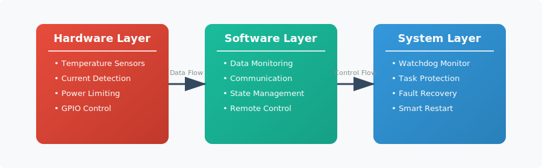
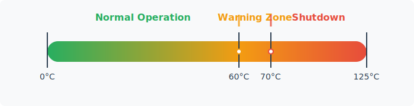
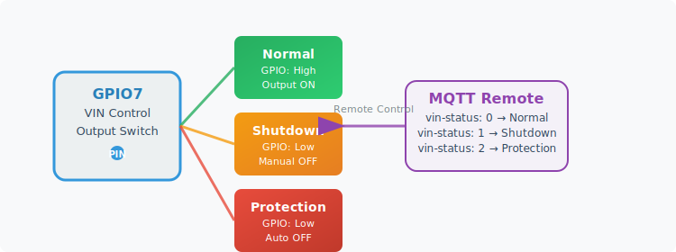
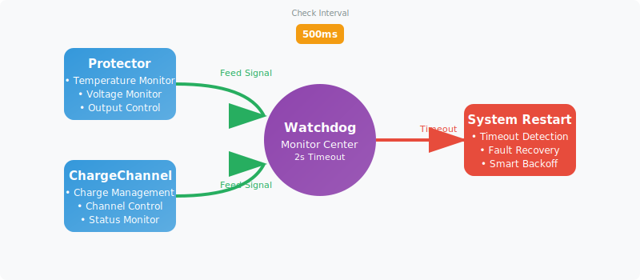
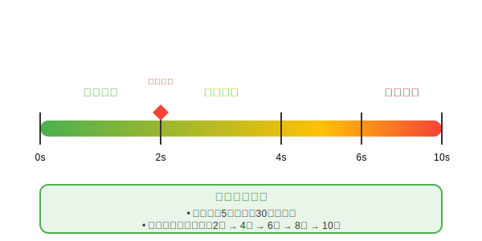
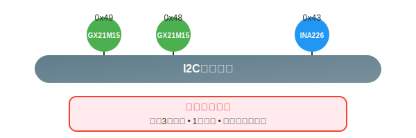
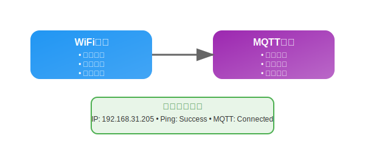
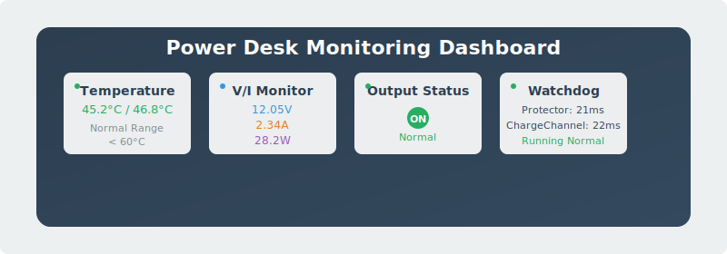

# Power Desk Monitoring & Protection System

This document provides a detailed description of the Power Desk power management device's monitoring system and protection mechanisms, including temperature monitoring, voltage/current monitoring, hardware power limiting, watchdog protection, and other features.

## 🛡️ System Overview

Power Desk adopts a multi-layer monitoring architecture, providing data collection, hardware protection, and task monitoring functions:



## 🌡️ Temperature Monitoring System

### 1. Hardware Components

**Temperature Sensors**: GX21M15 (Dual Channel)

- **Sensor Addresses**: 0x49 (sensor_0), 0x48 (sensor_1)
- **Measurement Accuracy**: ±0.5°C
- **Response Time**: <1 second
- **Operating Range**: -40°C ~ +125°C

### 2. Configuration Parameters

```rust
struct TemperatureConfig {
    hysteresis: f32,        // Temperature hysteresis: 60.0°C (configured but unused)
    over_shutdown: f32,     // Over-temperature shutdown: 70.0°C (configured but unused)
}
```

**Note**: Although temperature configuration parameters exist, the current version **does not implement temperature protection logic**, only data collection.

### 3. Temperature Monitoring Flow



```rust
pub async fn run_task_once(&mut self) -> Result<(), E> {
    // Read dual temperature sensors
    self.current_state.temperature_0 = self.gx21m15_0.get_temperature().await?;
    self.current_state.temperature_1 = self.gx21m15_1.get_temperature().await?;
    
    // Note: Current version only performs temperature data collection
    // Temperature protection logic is not yet implemented, although configuration parameters exist
    
    // Send data to monitoring channel
    self.temperature_channel.send(self.current_state).await;
}
```

## ⚡ Voltage & Current Monitoring System

### 1. Hardware Components

**Voltage & Current Monitor**: INA226

- **Monitor Address**: 0x43
- **Voltage Precision**: 1.25mV
- **Current Precision**: 2.5μA
- **Function**: Real-time data collection and monitoring

### 2. Monitoring Configuration

```rust
// INA226 Configuration
let config = ina226::Config {
    mode: ina226::MODE::ShuntBusVoltageContinuous,  // Continuous monitoring mode
    avg: ina226::AVG::_4,                           // 4x averaging
    vbusct: ina226::VBUSCT::_588us,                // Voltage conversion time
    vshct: ina226::VSHCT::_588us,                  // Shunt conversion time
};

// Calibration parameters
self.ina226.callibrate(0.01, 5.0).await?; // 0.01Ω shunt, 5A max current
```

### 3. Data Collection

```rust
// Real-time data collection
self.current_state.millivolts = self.ina226.bus_voltage_millivolts().await?;
match self.ina226.current_amps().await? {
    Some(amps) => {
        self.current_state.amps = -amps;
    }
    None => {
        log::info!("Failed to read input current");
    }
}
match self.ina226.power_watts().await? {
    Some(watts) => {
        self.current_state.watts = watts;
    }
    None => {
        log::info!("Failed to read input power");
    }
}

// Note: Current version only performs data collection, no software-level voltage/current protection logic
```

## 🔌 Hardware Power Limiting

### 1. Charging Channel Power Limiting

**SW3526 Charging Chips**: Hardware-level power limiting for each charging channel

```rust
// Set 65W power limit for each charging channel during initialization
self.sw3526
    .set_output_limit_watts(65)
    .await
    .map_err(|err| ChargeChannelError::I2CError(err))?;
```

**Features**:

- **Hardware-level limiting**: Directly controlled by SW3526 chip
- **Per-channel limiting**: Maximum 65W per charging channel
- **Automatic protection**: Chip automatically reduces power when limit exceeded
- **No software intervention**: No software monitoring and control required

## 🔌 Output Control System

### 1. VIN Control Logic



**Control Pin**: GPIO7

- **Default State**: Low (output disabled)
- **Normal Operation**: High (output enabled)
- **Protection State**: Low (output disabled)

### 2. Output State Management

```rust
#[derive(Debug, Clone, Copy)]
pub enum VinState {
    Normal,      // Normal operation state
    Shutdown,    // Manual shutdown state
    Protection,  // Protection shutdown state
}

// State determination logic
self.current_state.vin_status = if self.shutdown {
    VinState::Shutdown      // Manual shutdown
} else if self.vin_ctl_pin.is_set_high() {
    VinState::Normal        // Normal operation
} else {
    VinState::Protection    // Protection state
};
```

## 🐕 Watchdog Protection System

### 1. Monitoring Architecture



### 2. Smart Protection Mechanism



```rust
#[derive(Debug, Clone, Copy, PartialEq)]
pub enum WatchedTask {
    Protector,      // Temperature protection task
    ChargeChannel,  // Charging channel task
}

// Smart backoff strategy
fn should_apply_backoff(&self) -> bool {
    const MAX_CONSECUTIVE_RESTARTS: u32 = 5;
    const BACKOFF_WINDOW_MS: u64 = 30000; // 30 seconds
    
    if self.consecutive_restarts >= MAX_CONSECUTIVE_RESTARTS {
        if let Some(last_restart) = self.last_restart_time {
            if last_restart.elapsed().as_millis() < BACKOFF_WINDOW_MS {
                return true; // Apply backoff strategy
            }
        }
    }
    false
}
```

## 🔄 Communication Protection Mechanisms

### 1. I2C Communication Protection



**Error Handling**:

- **Retry mechanism**: Maximum 3 retries
- **Timeout protection**: 1 second communication timeout
- **Error recovery**: Automatic re-initialization

```rust
const MAX_FAIL_TIMES: u8 = 3;

// I2C error handling
match protector.run_task_once().await {
    Ok(_) => {
        fail_times = 0; // Reset error count
    }
    Err(err) => {
        fail_times += 1;
        log::warn!("I2C communication error: {:?}", err);
        
        if fail_times >= MAX_FAIL_TIMES {
            log::error!("Max I2C failures reached - reinitializing");
            protector.init().await?; // Re-initialize
            fail_times = 0;
        }
    }
}
```

### 2. Network Communication Protection



## 📊 System Monitoring

### 1. Real-time Status Monitoring



**Real-time Status Reports**:

```log
INFO - Temperature: 45.2°C / 46.8°C
INFO - Voltage: 12.05V, Current: 2.34A, Power: 28.2W
INFO - VIN Status: Normal
INFO - Watchdog: Protector: 21ms ago, ChargeChannel: 22ms ago
```

### 2. System Parameter Configuration

| System Type | Parameter | Default Value | Range | Description |
|-------------|-----------|---------------|-------|-------------|
| **Temperature Monitoring** | Temperature Hysteresis | 60.0°C | 50-80°C | Config parameter (unused) |
| | Over-temperature Shutdown | 70.0°C | 60-90°C | Config parameter (unused) |
| | Detection Interval | 1000ms | 500-5000ms | Temperature detection frequency |
| **Hardware Power Limiting** | Per-channel Limit | 65W | Fixed value | SW3526 chip hardware limit |
| **Watchdog Protection** | Timeout Duration | 2000ms | 1000-10000ms | Task timeout threshold |
| | Check Interval | 500ms | 100-1000ms | Watchdog check frequency |
| | Max Restarts | 5 times/30s | 3-10 times | Backoff protection parameter |

## 🚀 System Advantages


### 1. Multi-layer Monitoring

- **Hardware-level monitoring**: Real-time sensor data collection
- **Hardware-level limiting**: SW3526 chip power limiting
- **System-level protection**: Watchdog task monitoring

### 2. Smart Management

- **Remote control**: MQTT remote switch control
- **Status monitoring**: Real-time data collection and reporting
- **Automatic recovery**: Watchdog automatic restart mechanism

### 3. System Reliability

- **Task monitoring**: Watchdog prevents task deadlock
- **Smart backoff**: Prevents frequent restarts
- **Data transparency**: Complete status monitoring and logging

---

*The Power Desk monitoring system ensures stable operation of power management devices through hardware-level power limiting, real-time data monitoring, and watchdog task protection. The current version primarily provides data collection, remote control, and task monitoring functions, laying the foundation for future protection feature expansion.*
