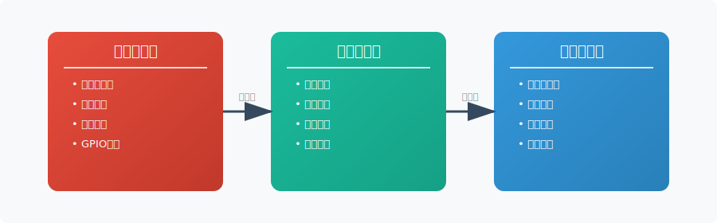
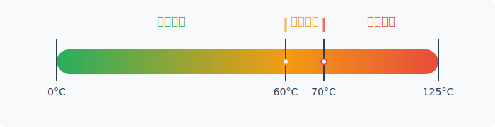
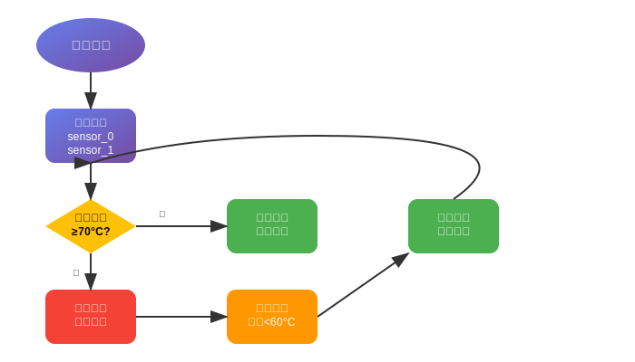
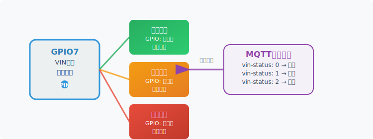
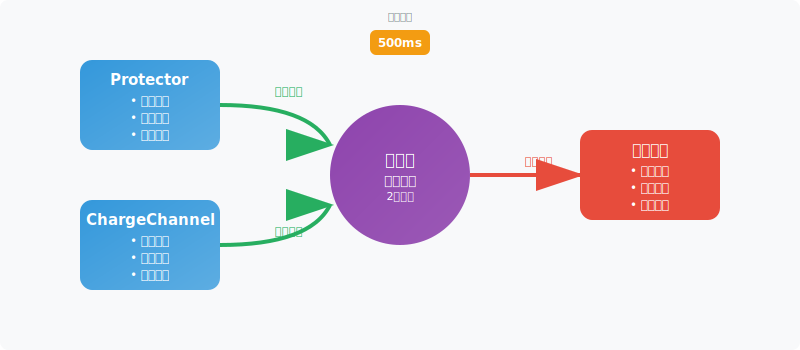
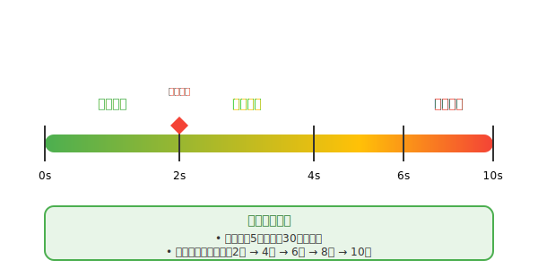
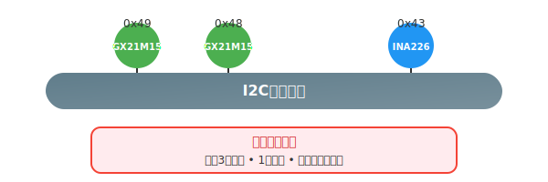
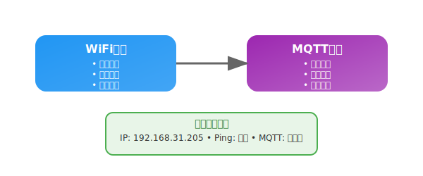
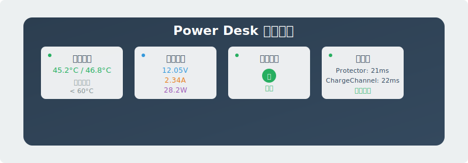
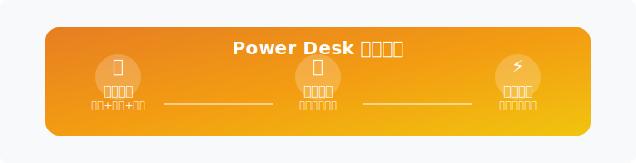

# Power Desk 监控与保护系统文档

本文档详细描述了 Power Desk 电源管理设备的监控系统和保护机制，包括温度监控、电压电流监控、硬件功率限制、看门狗保护等功能。

## 🛡️ 系统概述

Power Desk 采用多层监控架构，提供数据采集、硬件保护和任务监控功能：



## 🌡️ 温度监控系统

### 1. 硬件组件

**温度传感器**：GX21M15 (双路)

- **传感器地址**：0x49 (sensor_0), 0x48 (sensor_1)
- **测量精度**：±0.5°C
- **响应时间**：<1秒
- **工作范围**：-40°C ~ +125°C

### 2. 配置参数



```rust
struct TemperatureConfig {
    hysteresis: f32,        // 温度回滞：60.0°C（配置存在但未使用）
    over_shutdown: f32,     // 过温关断：70.0°C（配置存在但未使用）
}
```

**注意**：虽然有温度配置参数，但当前版本**没有实现温度保护逻辑**，仅进行数据采集。

### 3. 温度监控流程



```rust
pub async fn run_task_once(&mut self) -> Result<(), E> {
    // 读取双路温度传感器
    self.current_state.temperature_0 = self.gx21m15_0.get_temperature().await?;
    self.current_state.temperature_1 = self.gx21m15_1.get_temperature().await?;

    // 注意：当前版本仅进行温度数据采集
    // 温度保护逻辑尚未实现，虽然有配置参数但没有保护判断代码

    // 数据发送到监控通道
    self.temperature_channel.send(self.current_state).await;
}
```

## ⚡ 电压电流监控系统

### 1. 硬件组件

**电流电压监控**：INA226

- **监控地址**：0x43
- **电压精度**：1.25mV
- **电流精度**：2.5μA
- **功能**：实时数据采集和监控

### 2. 监控配置

```rust
// INA226 配置
let config = ina226::Config {
    mode: ina226::MODE::ShuntBusVoltageContinuous,  // 连续监控模式
    avg: ina226::AVG::_4,                           // 4次平均
    vbusct: ina226::VBUSCT::_588us,                // 电压转换时间
    vshct: ina226::VSHCT::_588us,                  // 分流器转换时间
};

// 校准参数
self.ina226.callibrate(0.01, 5.0).await?; // 0.01Ω分流器，5A最大电流
```

### 3. 数据采集

```rust
// 实时数据采集
self.current_state.millivolts = self.ina226.bus_voltage_millivolts().await?;
match self.ina226.current_amps().await? {
    Some(amps) => {
        self.current_state.amps = -amps;
    }
    None => {
        log::info!("Failed to read input current");
    }
}
match self.ina226.power_watts().await? {
    Some(watts) => {
        self.current_state.watts = watts;
    }
    None => {
        log::info!("Failed to read input power");
    }
}

// 注意：当前版本仅进行数据采集，没有实现软件级电压电流保护逻辑
```

## 🔌 硬件功率限制

### 1. 充电通道功率限制

**SW3526充电芯片**：每个充电通道的硬件级功率限制

```rust
// 每个充电通道初始化时设置65W功率限制
self.sw3526
    .set_output_limit_watts(65)
    .await
    .map_err(|err| ChargeChannelError::I2CError(err))?;
```

**特点**：
- **硬件级限制**：由SW3526芯片直接控制
- **单通道限制**：每个充电通道最大65W
- **自动保护**：超过限制时芯片自动降功率
- **无软件干预**：不需要软件监控和控制

## 🔌 输出控制系统

### 1. VIN控制逻辑



**控制引脚**：GPIO7

- **默认状态**：Low (输出关断)
- **正常运行**：High (输出开启)
- **保护状态**：Low (输出关断)

### 2. 输出状态管理

```rust
#[derive(Debug, Clone, Copy)]
pub enum VinState {
    Normal,      // 正常运行状态
    Shutdown,    // 手动关断状态
    Protection,  // 保护关断状态
}

// 状态判断逻辑
self.current_state.vin_status = if self.shutdown {
    VinState::Shutdown      // 手动关断
} else if self.vin_ctl_pin.is_set_high() {
    VinState::Normal        // 正常运行
} else {
    VinState::Protection    // 保护状态
};
```

## 🐕 看门狗保护系统

### 1. 监控架构



### 2. 智能保护机制



```rust
#[derive(Debug, Clone, Copy, PartialEq)]
pub enum WatchedTask {
    Protector,      // 温度保护任务
    ChargeChannel,  // 充电通道任务
}

// 智能退避策略
fn should_apply_backoff(&self) -> bool {
    const MAX_CONSECUTIVE_RESTARTS: u32 = 5;
    const BACKOFF_WINDOW_MS: u64 = 30000; // 30秒
    
    if self.consecutive_restarts >= MAX_CONSECUTIVE_RESTARTS {
        if let Some(last_restart) = self.last_restart_time {
            if last_restart.elapsed().as_millis() < BACKOFF_WINDOW_MS {
                return true; // 应用退避策略
            }
        }
    }
    false
}
```

## 🔄 通信保护机制

### 1. I2C通信保护



**错误处理**：

- **重试机制**：最多3次重试
- **超时保护**：1秒通信超时
- **错误恢复**：自动重新初始化

```rust
const MAX_FAIL_TIMES: u8 = 3;

// I2C错误处理
match protector.run_task_once().await {
    Ok(_) => {
        fail_times = 0; // 重置错误计数
    }
    Err(err) => {
        fail_times += 1;
        log::warn!("I2C communication error: {:?}", err);
        
        if fail_times >= MAX_FAIL_TIMES {
            log::error!("Max I2C failures reached - reinitializing");
            protector.init().await?; // 重新初始化
            fail_times = 0;
        }
    }
}
```

### 2. 网络通信保护



## 📊 保护系统监控

### 1. 实时状态监控



**实时状态报告**：

```log
INFO - Temperature: 45.2°C / 46.8°C
INFO - Voltage: 12.05V, Current: 2.34A, Power: 28.2W
INFO - VIN Status: Normal
INFO - Watchdog: Protector: 21ms ago, ChargeChannel: 22ms ago
```

### 2. 系统参数配置

| 系统类型 | 参数 | 默认值 | 范围 | 说明 |
|----------|------|--------|------|------|
| **温度监控** | 温度回滞 | 60.0°C | 50-80°C | 配置参数（未使用） |
| | 过温关断 | 70.0°C | 60-90°C | 配置参数（未使用） |
| | 检测间隔 | 1000ms | 500-5000ms | 温度检测频率 |
| **硬件功率限制** | 单通道限制 | 65W | 固定值 | SW3526芯片硬件限制 |
| **看门狗保护** | 超时时间 | 2000ms | 1000-10000ms | 任务超时阈值 |
| | 检查间隔 | 500ms | 100-1000ms | 看门狗检查频率 |
| | 最大重启 | 5次/30秒 | 3-10次 | 退避保护参数 |

## 🚀 保护系统优势



### 1. 多层监控

- **硬件级监控**：传感器实时数据采集
- **硬件级限制**：SW3526芯片功率限制
- **系统级保护**：看门狗任务监控

### 2. 智能管理

- **远程控制**：MQTT远程开关控制
- **状态监控**：实时数据采集和上报
- **自动恢复**：看门狗自动重启机制

### 3. 系统可靠性

- **任务监控**：看门狗防止任务卡死
- **智能退避**：防止频繁重启
- **数据透明**：完整的状态监控和日志

---

*Power Desk 监控系统通过硬件级功率限制、实时数据监控和看门狗任务保护，确保电源管理设备的稳定运行。当前版本主要提供数据采集、远程控制和任务监控功能，为后续的保护功能扩展奠定了基础。*
